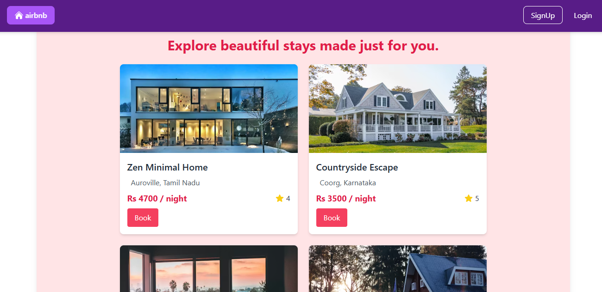
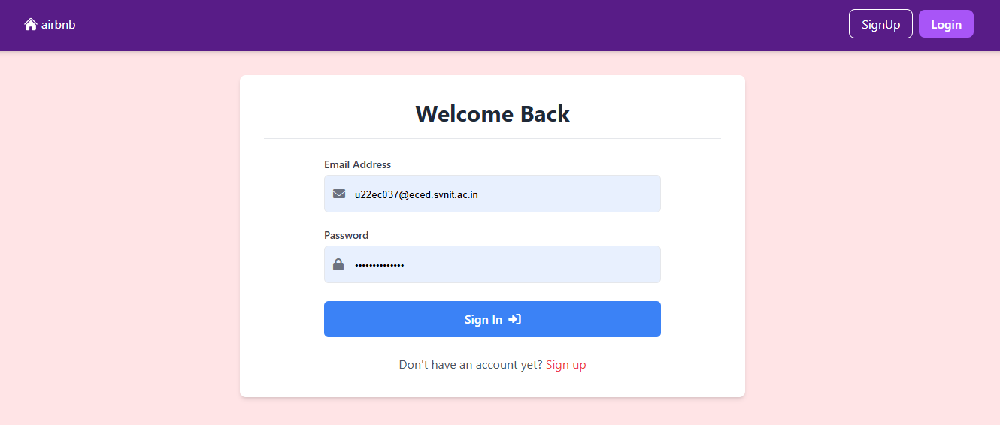
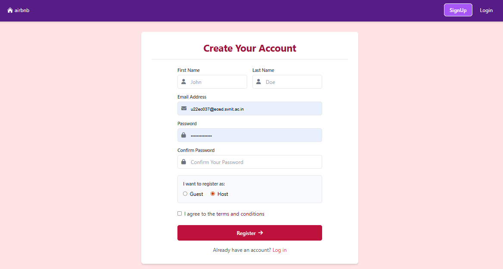
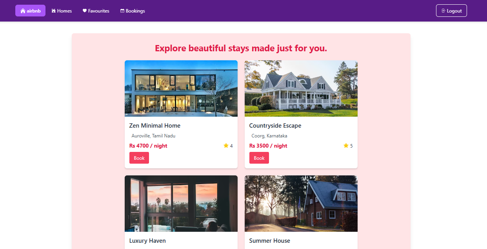
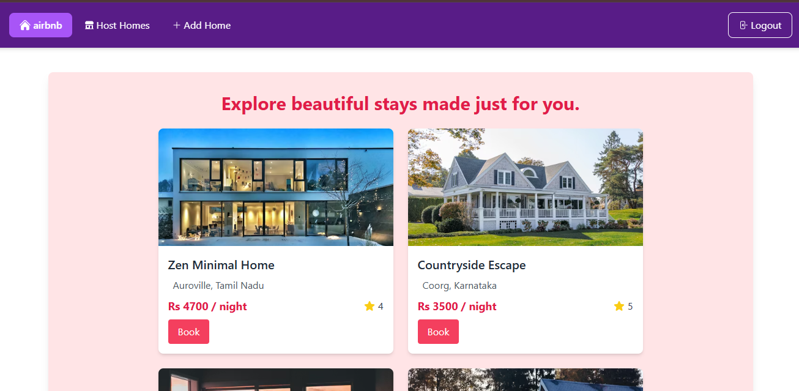

# 🏠 Airbnb Clone (Full Stack Web Application)

A full-stack **Airbnb Clone** that replicates core functionalities of the Airbnb platform, including user authentication, host listings, and guest browsing experience.  
This project is built to demonstrate **real-world web development skills**, clean UI, and structured backend logic.

---

## 🚀 Features

### 👤 Authentication
- User Sign Up & Login
- Secure authentication flow
- Separate flows for **Host** and **Guest**

### 🏠 Hosting Features
- Host dashboard
- Add & manage property listings
- View hosted properties

### 🧳 Guest Features
- Browse available properties
- View property details
- User-friendly guest experience

### 🎨 UI / UX
- Clean & responsive design
- Modern layout inspired by Airbnb
- Smooth navigation between pages

---

## 🛠️ Tech Stack
- **Frontend:** React.js  
- **Styling:** CSS / Tailwind CSS  
- **Backend:** Node.js, Express.js  
- **Database:** MongoDB  
- **Authentication:** JWT / Session based auth  
- **Tooling:** Git, GitHub  

---

## 📂 Project Structure
src/
│── components/ # Reusable UI components
│── pages/ # Home, Login, Signup, Host, Guest
│── routes/ # Application routes
│── services/ # API & business logic
│── utils/ # Helper functions
│── assets/ # Images & static files

yaml
Copy code

---

## 📸 Screenshots

### 🏠 Home Page


### 🔐 Login Page


### 📝 Sign Up Page


### 🧳 Guest Page


### 🏡 Host Page


---

## 📌 How to Run Locally
1. Clone the repository  
```bash
git clone <repo-link>
Install dependencies

bash
Copy code
npm install
Start the development server

bash
Copy code
npm start
Open in browser

arduino
Copy code
http://localhost:3000
